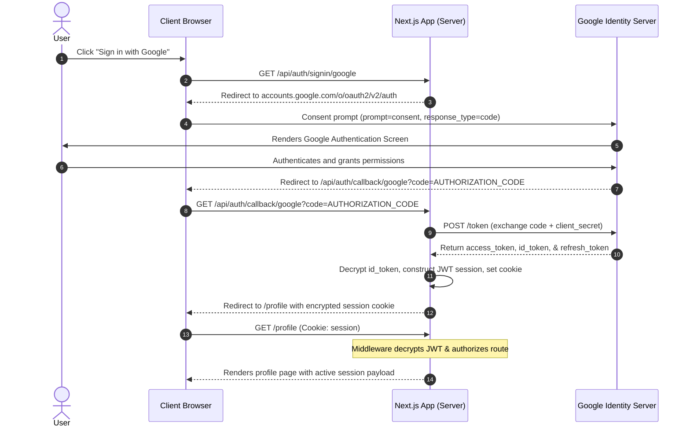

# oauth-handshake-demo

A Next.js 14 application demonstrating the OAuth 2.0 Authorization Code flow using Google as the identity provider. It serves as a minimal blueprint showing how access codes are exchanged for secure server-side session tokens, with session states rendered dynamically in an editorial, component-isolated dashboard.

---

## OAuth 2.0 Authorization Code Flow



---

## Tech Stack

*   **Framework**: Next.js 14 (App Router)
*   **Authentication**: Auth.js v5 (next-auth@beta)
*   **Styling**: Tailwind CSS
*   **Language**: TypeScript
*   **Graphics**: WebGL (ShaderBackground) & interactive canvas components

---

## Setup Instructions

### 1. Clone the repository and install dependencies
```bash
git clone https://github.com/Vilsee/oauth-handshake-demo.git
cd oauth-handshake-demo
npm install
```

### 2. Configure Google Cloud Console
1.  Go to the [Google Cloud Console](https://console.cloud.google.com/).
2.  Create a new project or select an existing one.
3.  Navigate to **APIs & Services > Credentials**.
4.  Click **Create Credentials** and select **OAuth client ID**.
5.  Set the **Application type** to **Web application**.
6.  Under **Authorized JavaScript origins**, add:
    *   `http://localhost:3000`
7.  Under **Authorized redirect URIs**, add the exact Auth.js callback URL:
    *   `http://localhost:3000/api/auth/callback/google`
8.  Click **Create** and copy your **Client ID** and **Client Secret**.

### 3. Establish Environment Variables
Copy the `.env.local.example` file to create your local configurations:
```bash
cp .env.local.example .env.local
```

Open `.env.local` and populate the fields:
*   `GOOGLE_CLIENT_ID`: Your copied Client ID.
*   `GOOGLE_CLIENT_SECRET`: Your copied Client Secret.
*   `NEXTAUTH_URL`: `http://localhost:3000`
*   `NEXTAUTH_SECRET`: Generate a cryptographically secure key by running:
    ```bash
    openssl rand -base64 32
    ```

### 4. Run Development Server
```bash
npm run dev
```
Navigate to `http://localhost:3000` in your browser.

---

## Design Decisions

### 1. Isolated Edge Configuration
Auth.js v5 config is separated into two files: `lib/auth.config.ts` (edge-compatible callbacks, route configurations) and `lib/auth.ts` (Google provider definitions, node-specific cryptographic dependencies). This separation allows Next.js Edge Middleware to verify cookies and route users without importing bulky Node.js runtime APIs, maximizing performance and compatibility.

### 2. Client/Server Session Boundary
Authentication gating is enforced server-side. The `/profile` route uses the server-side `auth()` helper to verify the token state prior to layout rendering, triggering an immediate redirect (`redirect("/")`) if credentials are absent. A lightweight client-side `<SessionProvider>` is wrapper-isolated in a sub-component so that the root layout can remain an un-hydrated Server Component.

### 3. Custom Design Token Variable Injection
To avoid the default Tailwind CSS styling, custom CSS variables are bound inside `app/globals.css` and mapped to Tailwind properties inside `tailwind.config.ts`. Swapping light and dark values relies on media selectors directly updating CSS variables, bypassing the need for Tailwind state utilities like `dark:` classes on individual elements.

---

## Deployment

The application is configured for local-first testing due to its reliance on local callback configurations. If deploying to Vercel or Netlify, ensure you add the production URL under Google Console's **Authorized Redirect URIs** (`https://<your-domain>/api/auth/callback/google`) and update the `NEXTAUTH_URL` environment variable accordingly.
